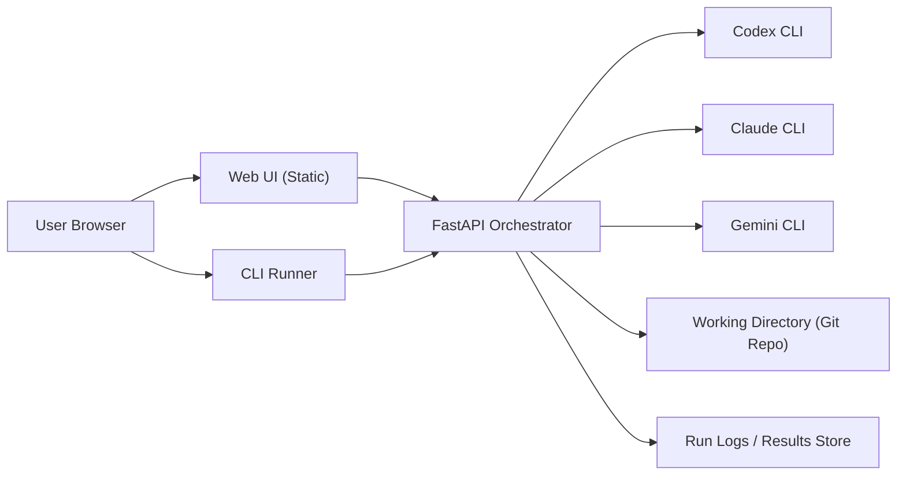
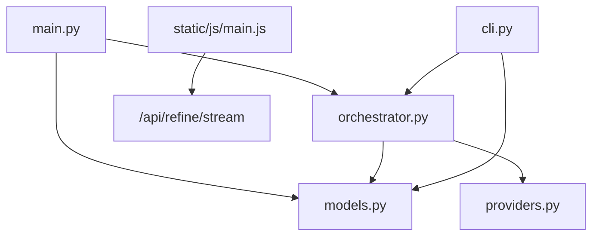
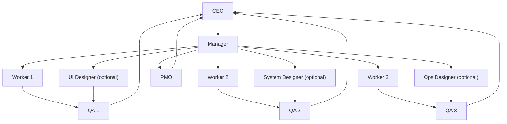
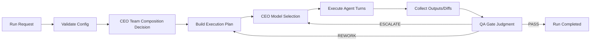
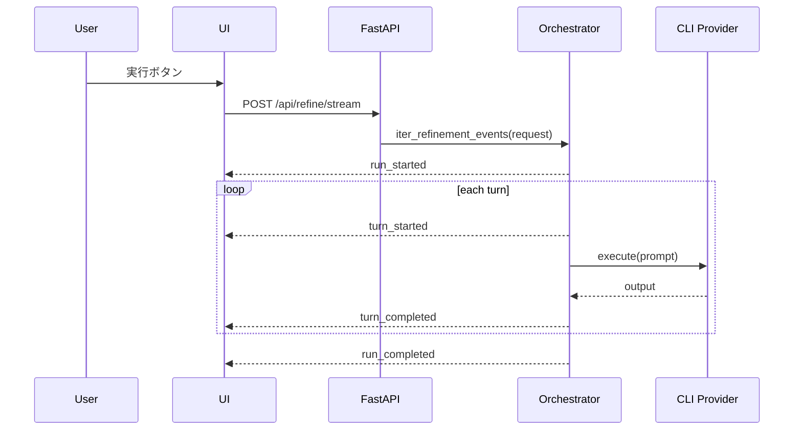
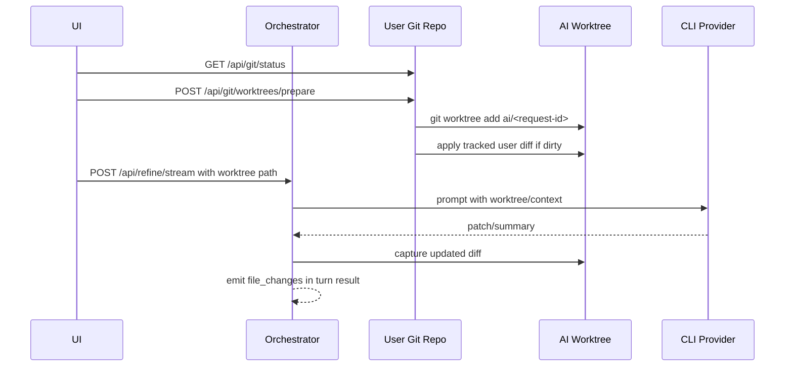

# V2 システム仕様書

## 1. 目的
本仕様は、AIエージェント同士をオーケストレーションして、計画・実装・検証・改善を継続実行できる開発プラットフォームの V2 要件を定義する。

## 2. 開発方式
- 基本方式: `Stage-Gate + PDCA`
- 進行単位:
  - `Plan`: Manager + PMO
  - `Do`: Worker
  - `Check`: QA
  - `Act`: CEO + Manager

## 3. 組織体制（デフォルトテンプレート）
- `CEO x1`（最終意思決定、モデル選定）
- `Manager x1`（タスク分解、指示、進捗管理）
- `Worker x3`（設計・実装）
- `PMO x1`（計画整合、進捗・リスク監視）
- `QA x3`（設計/コード/テストの検証、全員レビュー）

### 3.1 個別設定（全エージェント）
- `enabled`
- `id`, `name`
- `org_role` (`ceo|manager|worker|pmo|qa|ui_designer|system_designer|ops_designer|other`)
- `provider` (`codex_cli|claude_cli|gemini_cli|custom_cli`)
- `model`
- `persona`
- `skills[]`
- `depends_on[]`
- `model_decision` (`fixed|ceo_decides`)
- `command_template` (`custom_cli` 時必須)
- `mcp_enabled`
- `mcp_config_path`
- `mcp_servers[]`
- `mcp_instruction`
- `mcp_context_command`
- `mcp_timeout_sec`

### 3.2 モデル決定ルール
- `manager/worker/pmo/qa` は `model_decision=ceo_decides` を標準とする。
- 実行開始前に CEO が対象エージェントの `provider/model` を決定する。
- CEO 決定結果は実行ログに記録し、再現可能性を担保する。
- `ui_designer/system_designer/ops_designer` も `ceo_decides` 対象に含める。

### 3.2.1 チーム構成決定ルール（CEO）
- デフォルトは最小構成で開始し、固定配置にはしない。
- 実行前に CEO が以下を判断して `enabled` を切り替える。
  - 画面設計が必要か（`ui_designer`）
  - システム設計が必要か（`system_designer`）
  - 運用設計が必要か（`ops_designer`）
- CEO はタスク特性（新規画面の有無、非機能要件、運用要件）を根拠に構成を選択する。

### 3.3 1人仕様（ロール単位）
#### CEO（1人）
- 役割: 最終意思決定、優先順位付け、モデル選定
- 入力: Manager計画、PMO指摘、QA判定、未確定仕様Issue
- 出力: 実行承認、方針変更、モデル割当結果
- 権限: Gate最終承認、`ESCALATE` 案件の裁定

#### Manager（1人）
- 役割: タスク分解、作業指示、進行管理
- 入力: CEO方針、PMO/QAフィードバック
- 出力: 実行計画、Worker指示、再計画案
- 権限: `REWORK` 再割当、優先度調整

#### PMO（1人）
- 役割: 計画整合性チェック、進捗/リスク監視
- 入力: Manager計画、実績ログ、QA結果
- 出力: 計画レビュー、リスク報告、是正提案
- 権限: Gate前レビュー必須化

#### Worker（各1人、標準3人）
- 役割: 設計・実装・修正
- 入力: Manager指示、依存エージェント出力
- 出力: 設計案、コード、変更要約
- 権限: 実装方式の提案（最終決定はManager/CEO）

#### QA（各1人、最低3人）
- 役割: 仕様/設計/コードの検証、テストコード作成、動作確認
- 入力: Worker成果物、仕様、受入条件
- 出力: `PASS/REWORK/ESCALATE` 判定、不明確仕様Issue
- 権限: 品質ゲート判定（全員PASSが進行条件）

#### UI Designer（各1人、必要時）
- 役割: 画面デザイン、情報設計、UI仕様化
- 入力: 要件、ユーザーシナリオ、ブランド/トーン
- 出力: 画面仕様、レイアウト方針、コンポーネント指示
- 権限: UI仕様の提案（承認はCEO/Manager）

#### System Designer（各1人、必要時）
- 役割: システム構成、モジュール分割、境界設計
- 入力: 要件、制約、既存アーキテクチャ
- 出力: 構成方針、インターフェース設計、トレードオフ
- 権限: 構成案の提案（承認はCEO/Manager）

#### Ops Designer（各1人、必要時）
- 役割: 運用設計、監視設計、障害運用設計
- 入力: 非機能要件、SLO、デプロイ条件
- 出力: 運用Runbook、監視項目、アラートポリシー
- 権限: 運用案の提案（承認はCEO/PMO）

## 4. 機能要件
- オーケストレーション:
  - `sequential`
  - `role_based`
  - `dependency_graph`
- 実行インターフェース:
  - Web UI
  - CLI
- 実行モード:
  - `writing`
  - `coding`（`working_directory` 指定時はリポジトリに対して実コード変更）
- MCP連携:
  - エージェント単位でON/OFF
  - 必要時はMCPコンテキスト取得コマンドを実行してプロンプト注入
- 監査ログ:
  - 実行計画
  - 各ターン出力
  - エラー
  - 差分
  - ファイル変更（coding時）

## 5. QA ゲート仕様
- QA は最低3名稼働。
- すべての成果物を QA 3名が個別レビュー。
- 判定:
  - `PASS`
  - `REWORK`
  - `ESCALATE`
- 進行条件:
  - 全員 `PASS` のみ次工程へ進行可能。
  - 1人でも `REWORK` なら差し戻し。
  - 不明確仕様は `ESCALATE` として Manager/CEO へ報告。
- テスト:
  - QA はテストコード作成を担当。
  - `unit + integration + smoke` を標準実行。
  - 実行結果と動作確認結果をログ保存。

## 6. インフラ構成
- 単体運用（ローカル/1VM）を標準。
- 構成要素:
  - FastAPI アプリ（API + 静的配信）
  - CLI 実行環境（codex/claude/gemini）
  - Git 管理対象ワークディレクトリ（coding mode）
  - ローカル永続化（設定・履歴）
- 将来拡張:
  - 実行キュー（Redis）
  - 永続DB（PostgreSQL）
  - オブジェクトストレージ（ログ/成果物）

### 6.1 インフラ構成図

## 7. アプリケーション構成
- `app/main.py`: HTTP APIエントリ (`/api/refine`, `/api/refine/stream`)
- `app/orchestrator.py`: 実行計画構築、ターン制御、イベント発行
- `app/models.py`: リクエスト/レスポンス/バリデーション
- `app/providers.py`: Provider CLI 抽象化
- `app/cli.py`: CLI 実行
- `app/static/js/*`: UI状態管理、設定編集、ストリーミング表示

### 7.1 アプリ構成図

## 8. 全体構成図（組織 + 実行）

## 9. データフロー
1. ユーザーが UI/CLI から実行設定を送信。
2. オーケストレーターが設定を検証し、実行計画を作成。
3. CEO が対象ロールの `provider/model` を決定。
4. 各エージェント実行で `turn_started/turn_completed` を記録。
5. coding mode ではファイル差分を収集。
6. QA 判定を集約し、Gate 判定を実施。
7. `run_completed` と成果物を返却。

### 9.1 データフロー図

## 10. 通信フロー
### 10.1 UI 実行時

### 10.2 coding mode 通信フロー

Coding mode は元のローカル Git repository を原本として扱い、AI エージェントには専用 `git worktree` を渡す。ユーザが元repoを変更した後の追加依頼は、元repoの最新状態を新しい base として別 worktree を作る。これにより、ユーザ変更と AI 変更を branch / commit / diff 単位で分離して監査できる。

## 11. API I/O 方針
- 入力は `RefineRequest` を基準とする。
- 必須:
  - `source_text`
  - `agents[]`
- 主要拡張:
  - `orchestration_mode`
  - `depends_on`
  - `org_role`
  - `model_decision`

## 12. 非機能要件
- 再現性: 実行時の最終 `provider/model` と差分を保存
- 可観測性: ストリーミングイベントで進行可視化
- 安全性: working_directory 外の破壊操作は禁止
- 変更分離: coding mode では元repoを直接編集せず、AI 用 worktree に変更を閉じ込める
- 可用性: Providerエラー時も run を落とさず、ターン単位でエラー返却

## 13. 受け入れ条件
- CEOによるモデル決定が実行前に必ず行われる
- QA3名ルールが強制される
- dependency_graph で循環依存は拒否される
- UI/CLI どちらでも同じ結果フォーマットを取得できる
- 全構成図とフロー図がドキュメント化されている
